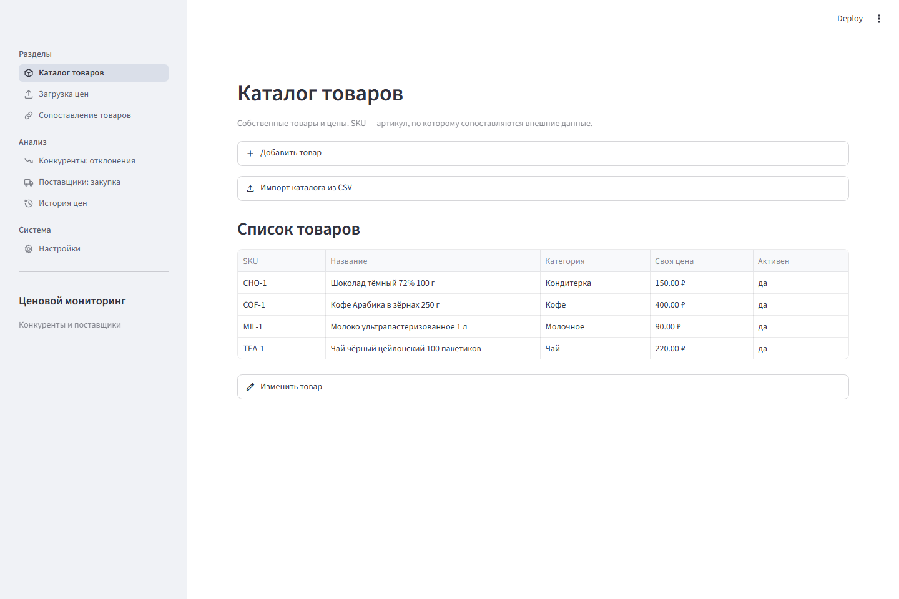
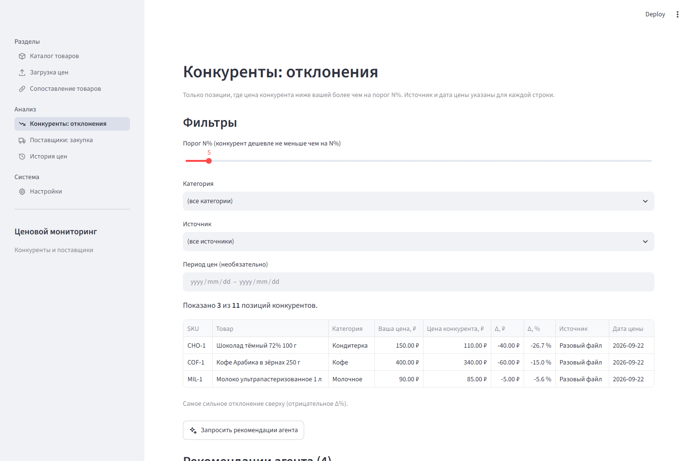
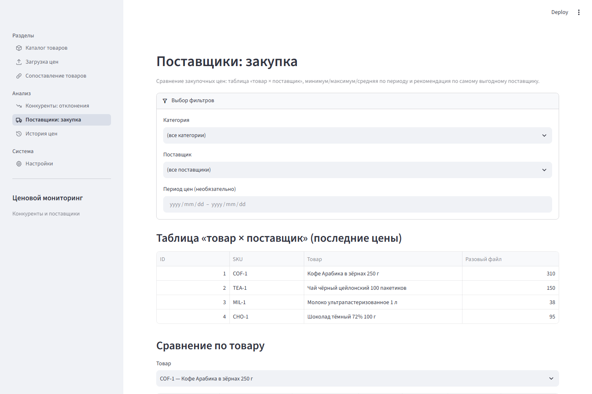
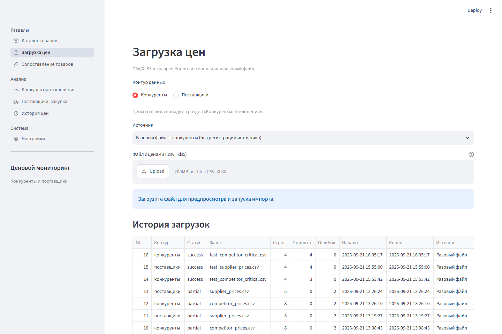
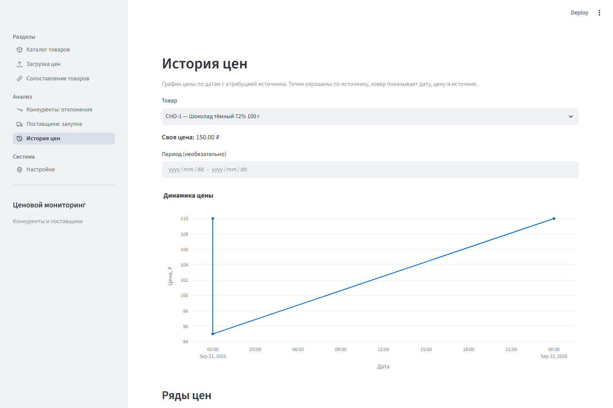
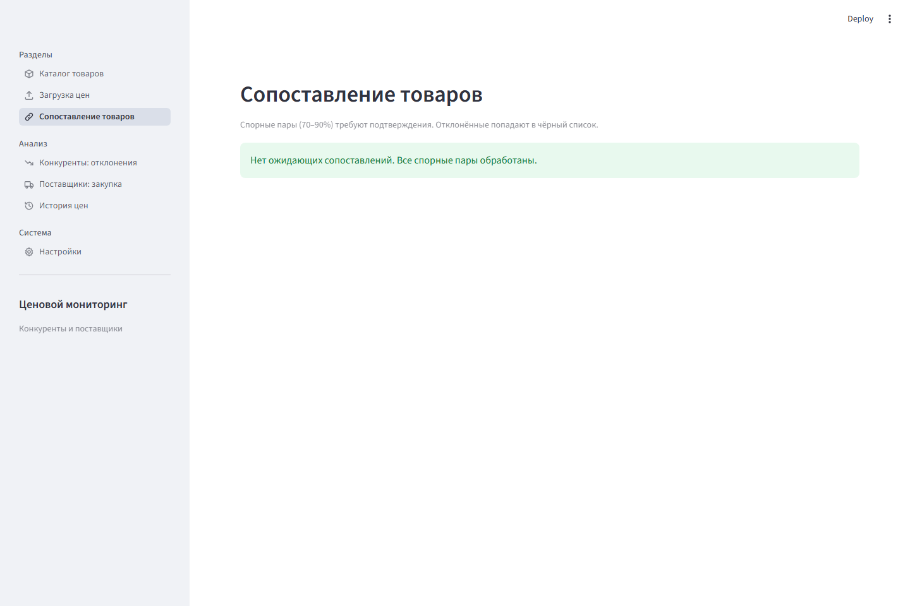
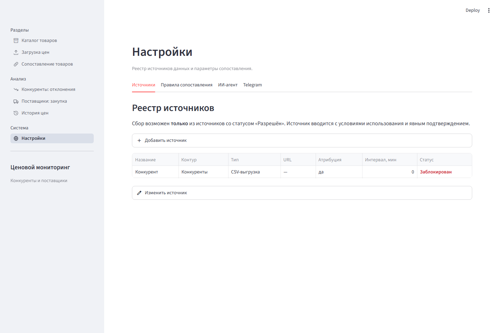

# Ценовой мониторинг: конкуренты и поставщики

Локальное однопользовательское веб-приложение для владельца небольшого магазина. Держит каталог своих товаров, сравнивает собственные цены с ценами конкурентов и поставщиков и подсвечивает, где конкурент продаёт заметно дешевле вас, а у кого из поставщиков выгоднее закупать.

Этот файл — руководство для человека, который впервые видит репозиторий: как установить проект с нуля, запустить, проверить, поддерживать и перенести на другой компьютер.

---

## 1. Что делает сервис и для кого он создан

Сервис предназначен для **одного владельца бизнеса** (единственная роль — «Владелец», без логинов и паролей). Все данные хранятся локально на вашем компьютере.

Два независимых контура данных:

- **Конкуренты** — розничные цены из прайсов/CSV. Приложение считает отклонение `(цена конкурента − ваша цена) / ваша цена × 100` и показывает в отчёте **только те позиции, где конкурент дешевле вас больше чем на заданный порог** (например, на 5%).
- **Поставщики** — закупочные прайсы. Приложение сводит всех поставщиков в таблицу «товар × поставщик» и подсказывает, у кого закупка выгоднее.

### Возможности

- **Каталог товаров** — свои SKU, названия, категории и цены; добавление и импорт из CSV.
- **Загрузка цен** (CSV/XLSX) для конкурентов и поставщиков — отдельно, с предпросмотром и понятным итогом импорта.
- **Автоматическое сопоставление** товаров:
  - точное совпадение SKU — подтверждается сразу;
  - нечёткое совпадение по названию ≥90% (один кандидат) — автоматически;
  - 70–90% — спорная зона, ждёт подтверждения владельца;
  - ниже 70% — «не сопоставлено». Отклонённые пары больше не предлагаются.
- **Отчёт по конкурентам** — только позиции с отклонением за порогом; всегда видны источник и дата цены; есть экспорт в CSV.
- **Сравнение поставщиков** — минимум/максимум/средняя за период по каждому поставщику и рекомендация по самому выгодному.
- **История цен** — график динамики цены по товару с пометкой источника.
- **ИИ-агент** — пишет человеческим языком обоснование к рекомендациям. Все расчёты выполняются локально и детерминированно; модель отвечает только за текст. Без настройки работает понятный режим-заглушка.
- **Уведомления в Telegram** — сообщение уходит сразу после импорта, если конкурент оказался дешевле вас больше настроенного порога.

---

## 2. Интерфейс: скриншоты



<table>
<tr>
<td width="50%">

**Конкуренты: отклонения**


</td>
<td width="50%">

**Поставщики: закупка**


</td>
</tr>
<tr>
<td width="50%">

**Загрузка прайса**


</td>
<td width="50%">

**История цены**


</td>
</tr>
</table>

<details>
<summary>Ещё два экрана — «Сопоставление» и реестр источников</summary>
<br>




</details>

---

## 3. Системные требования

| Компонент | Требование |
|---|---|
| Операционная система | Windows 10/11 (64-бит), macOS 12+, Linux (Ubuntu 20.04+, Debian 11+) |
| Python | **3.11 или новее** (проверено на 3.11–3.14) |
| Оперативная память | от 512 МБ свободной (рекомендуется 1 ГБ) |
| Место на диске | около 200 МБ |
| Браузер | актуальные Chrome, Edge, Firefox или Safari |
| Интернет | нужен при установке пакетов и для опциональных интеграций (ИИ-агент, Telegram Bot API) |

Поддерживаемые форматы цен: **CSV и XLSX**, до 20 МБ, до 50 000 строк, кодировка UTF-8 или cp1251. Валюта — только рубли (RUB).

---

## 4. Установка с чистого компьютера

Шаги ниже повторяют путь новых людей: клонировать репозиторий, создать виртуальное окружение, установить зависимости.

### 4.1. Установите Python

Скачайте Python 3.11+ с [python.org](https://www.python.org/downloads/) и установите, обязательно отметив галочку **«Add Python to PATH»**.

Проверьте:

```powershell
python --version
```

### 4.2. Склонируйте репозиторий

```powershell
git clone https://gitverse.ru/<ваш_логин>/<ваш_репозиторий>.git
cd <ваш_репозиторий>
```

Если репозитория на GitVerse ещё нет — создайте его на сайте (имя, например, `price-monitoring`) и склонируйте получившийся адрес.

### 4.3. Создайте виртуальное окружение

Windows (PowerShell):

```powershell
python -m venv .venv
.venv\Scripts\Activate.ps1
```

Windows (командная строка cmd):

```cmd
python -m venv .venv
.venv\Scripts\activate.bat
```

macOS и Linux:

```bash
python3 -m venv .venv
source .venv/bin/activate
```

После активации в начале строки приглашения появится `(.venv)`.

### 4.4. Установите зависимости

```powershell
pip install --upgrade pip
pip install -r requirements.txt
```

Установка займёт пару минут: Streamlit, Pandas, RapidFuzz, Plotly и test-инструменты.

---

## 5. Запуск

Из папки проекта (виртуальное окружение должно быть активировано):

```powershell
streamlit run app/main.py
```

Откроется браузер по адресу **http://localhost:8501** — приложение «Ценовой мониторинг».

Файл базы `db/monitoring.db` создаётся автоматически при первом запуске. Никакой дополнительной настройки не требуется — приложение сразу готово к работе.

Остановить приложение — нажать `Ctrl+C` в окне терминала.

---

## 6. Проверка работоспособности

### 6.1. Автотесты

В комплекте 371 тест (unit-тесты и проверки интерфейса без браузера). Из папки проекта:

```powershell
pytest -q
```

Ожидаемый результат — весь прогон зелёный (последней строкой `passed`). Тесты не ходят в сеть.

### 6.2. Главный пользовательский сценарий (за 5 минут)

В папке `sample_data/` лежат готовые файлы. Порядок действий по шагам:

1. **Каталог** → раскройте «Импорт каталога из CSV» → загрузите `sample_data/catalog_seed.csv` → «Импортировать товары». В каталоге появятся 4 товара.
2. **Загрузка цен** → выберите контур «Конкуренты», источник оставьте «Разовый файл» → загрузите `sample_data/test_competitor_critical.csv` → «Запустить импорт — конкуренты». Импорт завершится, все 4 SKU сопоставятся автоматически (точное совпадение).
3. **Конкуренты: отклонения** → при пороге по умолчанию вы увидите 3 позиции, где конкурент дешевле вас больше чем на 5%: шоколад (−26,7%), кофе (−15,0%) и молоко (−5,6%). Чай в отчёт не попадёт — конкурент продаёт его дороже вас.
4. **Загрузка цен** → переключите контур на «Поставщики» → загрузите `sample_data/test_supplier_prices.csv` → импортируйте.
5. **Поставщики: закупка** → выберите любой товар — увидите таблицу по поставщикам, минимум/максимум/среднюю за период.
6. **История цен** → выберите «Шоколад тёмный 72% 100 г» — появится график динамики цены с пометками источников.

Базу можно в любой момент сбросить: остановите приложение и удалите файл `db/monitoring.db` (при следующем запуске он создастся заново):

```powershell
Remove-Item db\monitoring.db
```

---

## 7. Переменные окружения и файл `.env.example`

Приложение конфигурируется двумя способами:

- через экран **Настройки** (пороги сопоставления, эндпоинт и модель агента, chat_id, порог уведомлений) — значения хранятся в таблице `settings` базы `db/monitoring.db`;
- через переменные окружения — для **секретов** (API-ключ агента, токен Telegram-бота) и пути к базе. Если переменная секрета задана, она имеет приоритет над экраном «Настройки», и в базу это значение не пишется.

Файл `.env` приложение читает автоматически при запуске (встроенный загрузчик `app/env.py`, без дополнительных библиотек). Сам файл `.env` в git не хранится; шаблон с именами переменных — в `.env.example`.

| Имя | Что делает |
|---|---|
| `MONITORING_DB` | Путь к файлу базы данных вместо стандартного `db/monitoring.db` (например, `D:\data\monitoring.db`) |
| `MONITORING_AGENT_API_KEY` | API-ключ ИИ-агента. Приоритет над экраном «Настройки», в базу не сохраняется |
| `MONITORING_TELEGRAM_BOT_TOKEN` | Токен Telegram-бота (от @BotFather). Приоритет над экраном «Настройки», в базу не сохраняется |

Прокси-переменные для доступа в интернет (если вы за корпоративным файрволом): стандартные `HTTP_PROXY`, `HTTPS_PROXY`, `NO_PROXY`.

Шаблон — в файле `.env.example` (в нём только имена и комментарии, значений нет).

---

## 8. Структура проекта

```
README.md         — этот файл
requirements.txt  — зависимости Python
.env.example      — шаблон переменных окружения (имена без значений)
db/               — файл базы данных monitoring.db (создаётся при запуске, в git не хранится)
docs/screenshots/ — скриншоты интерфейса для README
sample_data/      — тестовые CSV для быстрой проверки
app/
  main.py         — точка входа Streamlit (меню и старт)
  screens/        — тонкие обёртки-страницы для меню
  ui/             — экраны интерфейса (виджеты Streamlit)
  core/           — чистые функции: нормализация, сопоставление, отчёт, история
  services/       — бизнес-логика и интеграции: загрузка, агент, LLM, Telegram, настройки
  storage/        — SQLite: схема, миграции, репозитории
tests/            — автотесты (pytest + проверки UI)
```

Архитектурные принципы:

- История цен — только дозапись; ошибки загрузки никогда не переписывают прошлые данные.
- Загрузка идемпотентна: повторный импорт того же файла не создаёт дублей.
- Сбор данных возможен только из источников, которые владелец внёс в реестр со статусом «Разрешён» и явно принял условия. Парсинга сайтов «молча» в коде нет.
- Рекомендации ИИ-агента — подсказки, а не решения: каталог и цены агент не меняет, последнее слово за владельцем.

---

## 9. Обновление

1. Остановите приложение (`Ctrl+C`).
2. Получите новые версии кода:

```powershell
git pull gitverse master
```

3. Обновите зависимости:

```powershell
pip install -r requirements.txt
```

4. Запустите тесты:

```powershell
pytest -q
```

5. Запустите приложение:

```powershell
streamlit run app/main.py
```

База данных при обновлении не затрагивается: новые поля добавляются автоматическими миграциями при старте. Старые данные сохраняются.

---

## 10. Резервное копирование и восстановление

Вся информация — в одном файле базы `db/monitoring.db` (каталог, цены, сопоставления, настройки). Достаточно хранить копию этого файла.

### 10.1. Сделать резервную копию (без остановки приложения)

```powershell
python -c "import sqlite3; s=sqlite3.connect('db/monitoring.db'); d=sqlite3.connect('db/monitoring_backup.db'); s.backup(d); d.close(); s.close()"
```

Получится файл `db/monitoring_backup.db` — его можно положить в облако, на внешний диск или в систему резервного копирования. Рекомендую делать копию после каждого значимого набора данных.

### 10.2. Восстановление

1. Остановите приложение.
2. Замените текущую базу резервной копией:

```powershell
Copy-Item db\monitoring_backup.db db\monitoring.db
```

3. Запустите приложение.

> Примечание: база работает в режиме WAL — простое копирование файла `monitoring.db` во время работы приложения может «потерять» последние записи. Поэтому используйте команду из п. 10.1.

---

## 11. Известные ограничения

- **Один пользователь, локальный запуск.** Без логина и пароля — приложение не следует выкладывать в открытый интернет.
- **Только рубли (RUB).** Мультивалютность не поддерживается; цена в другой валюте — ошибка валидации строки.
- **Данные попадают вручную или из разрешённых источников.** Сбор из источника оформляется в реестре источников (Настройки) с принятием условий использования. Источник со статусом «Заблокирован» или с истёкшим сроком проверки использовать нельзя.
- **Лимиты загрузки:** CSV/XLSX, до 20 МБ, до 50 000 строк за раз.
- **Секреты.** API-ключ ИИ-агента и токен Telegram-бота рекомендуем задавать в файле `.env` (переменные `MONITORING_AGENT_API_KEY`, `MONITORING_TELEGRAM_BOT_TOKEN`) — тогда в базу они не попадают. Если переменные не заданы, значения вводятся на экране «Настройки» и хранятся в `db/monitoring.db` открытым текстом — в этом случае берегите базу, как пароль.
- **ИИ-агент пишет только текст.** Без настройки эндпоинта/ключà/модели работает режим-заглушка с локальными шаблонами — приложение честно показывает это на экране.
- **Уведомления** — только Telegram, только по контуру «Конкуренты», только сразу после импорта.

---

## 12. Если что-то не работает

| Симптом | Причина и решение |
|---|---|
| `python: command not found` / `не является внутренней или внешней командой` | Python не установлен или не в PATH. Установите с python.org, отметив «Add to Python PATH», переоткройте терминал. |
| PowerShell запрещает активацию окружения | Политика выполнения скриптов. Разрешите для текущего окна: `Set-ExecutionPolicy -Scope Process -ExecutionPolicy Bypass` |
| `ModuleNotFoundError: No module named 'streamlit'` | Окружение не активировано или зависимости не установлены. Проверьте `(.venv)` в начале строки и выполните `pip install -r requirements.txt`. |
| Страница не открывается по `localhost:8501` | Порт 8501 занят другим процессом. Запустите с другим портом: `streamlit run app/main.py --server.port 8502` |
| `database is locked` | Второй экземпляр приложения держит базу. Закройте лишнее окно/вкладку приложения. |
| Восстановление из копии не вернуло последние данные | Копия была сделана простым копированием во время работы. Сделайте копию по команде из п. 10.1 при остановленном приложении. |
| ИИ-агент: «Связи нет» | Проверьте коды ответа сервера: **401** — неверный ключ; **403** — агент остановлен в панели; **404** — неверный эндпоинт; **422** — неверное имя модели; **429** — слишком много запросов. Затем «Сохранить параметры агента» в Настройках и повторная проверка. |
| Telegram: «Не отправлено» | **401** — неверный токен бота; **403** — бот не может писать в этот чат/группу (нужно сначала написать боту самому); **404** — неверный токен; **429** — слишком часто. Проверьте и сохраните параметры в Настройках. |
| В терминале Windows «кракозябры» в русском тексте | Смените кодировку консоли: `chcp 65001` |
| Что-то ещё | Загляните в историю загрузок на экране «Загрузка цен» (статусы и итоги каждой загрузки) и в автотесты — пришлите вывод `pytest -q` и текст ошибки в поддержку (контакты ниже). |

### Где смотреть логи

- **История загрузок** — экран «Загрузка цен» (низ страницы): статус, число принятых строк и ошибки по каждой загрузке.
- **Журнал агента** — таблица `agent_log` в базе (все вызовы ИИ-агента с пометкой режима и причины отката на заглушку).
- **Запуск с подробным выводом** — в консоли терминала, где выполняется `streamlit run`.

---

## 13. Поддержка и контакты

Сопровождение проекта: **Ярослава** — владелец и единственный пользователь приложения.

- Репозиторий проекта находится на GitVerse.
- Сообщить об ошибке или предложить улучшение — заведите Issue в репозитории GitVerse либо обратитесь напрямую к разработчику проекта.