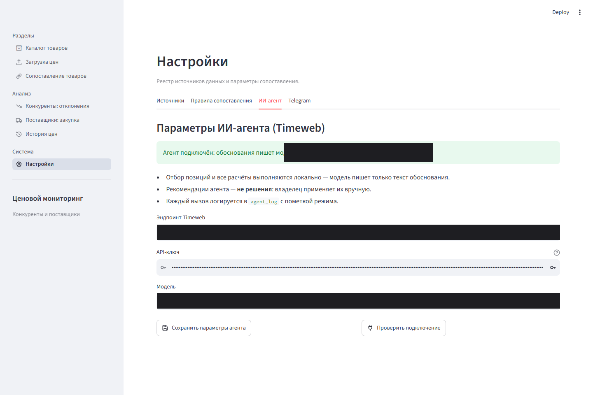
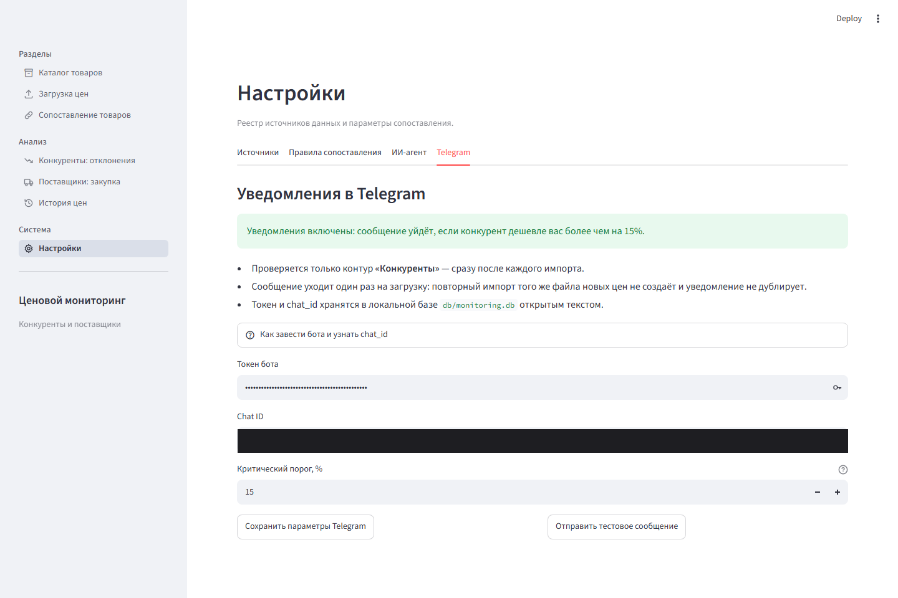

# Ценовой мониторинг: конкуренты и поставщики

Локальное однопользовательское приложение на Streamlit для владельца небольшого магазина: держит каталог товаров, сравнивает свою цену с ценами конкурентов и поставщиков и подсвечивает, где конкурент продаёт заметно дешевле.


## Что умеет

- **Каталог товаров** — свои SKU, названия, категории, цены.
- **Загрузка цен** (CSV/XLSX) — отдельно для конкурентов и поставщиков, с автоматическим сопоставлением по SKU и нечётким сравнением по названию.
- **Сопоставление** — точный SKU подтверждается сразу, нечёткие совпадения ≥90% — автоматически, 70–90% ждут ручного подтверждения владельца, ниже 70% считаются несопоставленными. Отклонённые пары не предлагаются повторно.
- **Отчёт по конкурентам** — только позиции, где цена конкурента ниже вашей больше чем на заданный порог; источник и дата цены видны всегда.
- **Сравнение поставщиков** — таблица «товар × поставщик», минимум/максимум/средняя за период, рекомендация по самому выгодному поставщику.
- **История цены** — график динамики по товару с привязкой к источнику.
- **ИИ-агент (Timeweb)** — пишет обоснование к рекомендациям человеческим языком. Все расчёты (кто дешевле, целевая цена, самый выгодный поставщик) считаются локально и детерминированно; агенту отдаётся только формулировка текста. При недоступности модели — понятный откат на локальный шаблон, без падения экрана.
- **Критические уведомления в Telegram** — сообщение уходит сразу после импорта, если конкурент оказался дешевле настроенного владельцем порога.

## Скриншоты

<table>
<tr>
<td width="50%">

**Отчёт по конкурентам**


</td>
<td width="50%">

**Сравнение поставщиков**


</td>
</tr>
<tr>
<td width="50%">

**Загрузка прайса**


</td>
<td width="50%">

**История цены**


</td>
</tr>
<tr>
<td width="50%">

**ИИ-агент подключён**


</td>
<td width="50%">

**Уведомления в Telegram**


</td>
</tr>
</table>

<details>
<summary>Ещё два экрана — «Сопоставление» и реестр источников</summary>
<br>


</details>

## Стек

Python 3.11+ · Streamlit · SQLite · Pandas · RapidFuzz (нечёткое сопоставление) · Plotly (графики) · `urllib` из стандартной библиотеки для HTTP-клиентов к Timeweb и Telegram Bot API — без лишних зависимостей ради пары запросов.

## Архитектура

```
app/
  main.py         — точка входа, st.navigation, подмена иконок
  screens/        — тонкие обёртки-страницы для st.navigation
  ui/              — экраны (Streamlit-виджеты), иконки, общий блок агента
  core/            — чистые функции: нормализация, сопоставление, расчёт отклонений
  services/        — бизнес-логика и интеграции: loads, matching, agent, llm, telegram…
  storage/         — SQLite: схема, миграции, репозитории
db/                — файл базы (не в репозитории, .gitignore)
sample_data/       — тестовые CSV для проверки импорта и уведомлений
tests/             — pytest + streamlit.testing.v1.AppTest, 371 тест
```

UI не обращается к SQLite напрямую — через `services/`; чистые расчёты живут в `core/` и тестируются без БД и без Streamlit.

### Правила проекта

- Сбор данных — только из источников со статусом «Разрешён» (реестр в Настройках, с условиями использования и явным согласием). Парсинг сайтов без разрешения архитектурно исключён.
- История цен — только дозапись; ошибки загрузки не переписывают прошлое.
- Загрузка идемпотентна: повторный импорт того же файла не дублирует цены (ключ — источник + контур + SKU + дата).
- Рекомендации агента — подсказки, не решения: каталог и цены он не меняет, последнее слово всегда за владельцем.

## Установка и запуск

```bash
python -m venv .venv
.venv\Scripts\activate          # Windows
# source .venv/bin/activate     # macOS/Linux

pip install -r requirements.txt
streamlit run app/main.py
```

Откроется на `http://localhost:8501`. База `db/monitoring.db` создаётся автоматически при первом запуске.

### Быстрая проверка

В `sample_data/` — готовые файлы для первого запуска:

1. `catalog_seed.csv` → экран **Каталог** → «Импорт каталога из CSV».
2. `test_competitor_critical.csv` → **Загрузка → Конкуренты** — две позиции окажутся дешевле порога в 15% и попадут в отчёт.
3. `test_supplier_prices.csv` → **Загрузка → Поставщики** — цены для сравнения закупки.

### Подключение ИИ-агента (необязательно)

Настройки → вкладка **«ИИ-агент»**: эндпоинт, ключ и модель (OpenAI-совместимый API, проверено на Timeweb Cloud AI). Без настройки агент работает в режиме шаблона — приложение честно показывает это на экране, а не притворяется, что модель ответила.

### Уведомления в Telegram (необязательно)

Настройки → вкладка **«Telegram»**: токен бота (от [@BotFather](https://t.me/BotFather)), chat_id и критический порог в процентах. Инструкция по получению chat_id — прямо на экране.

## Тесты

```bash
pytest -q
```

371 тест: pytest + `streamlit.testing.v1.AppTest` (клики, ввод, переходы между экранами без браузера) для UI, обычные unit-тесты для `core/`. Сетевые клиенты (`llm.py`, `telegram.py`) тестируются с подменённым транспортом — реальных запросов при прогоне тестов не происходит.

## Что не хранится в репозитории

`db/monitoring.db` — в `.gitignore`. Токены ИИ-агента и Telegram-бота хранятся только в локальной базе на вашей машине.
